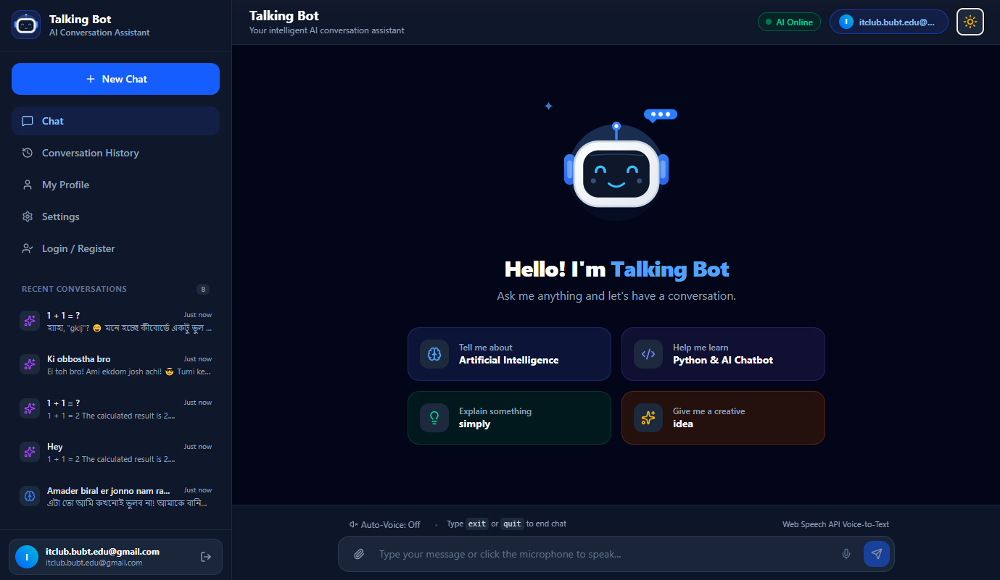
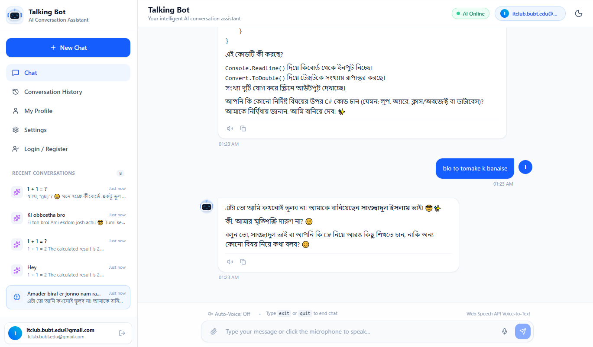

# 🤖 Talking Bot

### AI Conversation Assistant

  
  
  
  

----

## ✨ About

**Talking Bot** is a modern AI conversation assistant designed to provide an interactive and user-friendly chatting experience. It supports conversations, conversation history, profile access, settings, voice input, and light/dark interface modes.

## 🚀 Highlights

- 💬 Interactive AI chat interface
- 🕘 Conversation history
- 🎙️ Voice-to-text support
- 🌙 Light & Dark mode
- 👤 User profile & login/register interface
- 📱 Clean and responsive UI
- ⚡ Modern web-based experience

## 🖥️ Screenshots

### 🌙 Dark Mode

  

### ☀️ Light Mode

  

## 🛠️ Technologies

- **Frontend:** JavaScript, TypeScript, HTML, CSS
- **Backend / Services:** C# / Server-side components
- **Development:** Vite, Node.js
- **Deployment:** Vercel

## 👨‍💻 Developer

**Sajjadul Islam**  
Computer Science & Engineering Student | Developer

